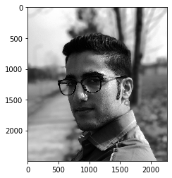
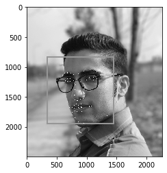

# Digital Image Processing - HW7 - 98722278 - Mohammad Doosti Lakhani
This notebook consists of:
1. First section contains following tasks:
    1. Study [AAM](https://www.cs.cmu.edu/~efros/courses/LBMV07/Papers/cootes-pami-01.pdf) paper and summarize it
    2. Study [CLM](http://citeseerx.ist.psu.edu/viewdoc/download?doi=10.1.1.455.357&rep=rep1&type=pdf) paper and summarize it
    3. Compare them with each other and also ASM (Active Shape Model)
2. `dlib` is a powerful library in image processing. For detecting face landmarks there are built-in methods in `cv2` and `dlib`
    1. Study the codes in linked here and write a program to calculate face landmarks via offline approach and demonstrates them ([link1](https://www.learnopencv.com/facemark-facial-landmark-detection-using-opencv/), [link2](https://towardsdatascience.com/facial-mapping-landmarks-with-dlib-python-160abcf7d672), [link3](https://www.pyimagesearch.com/2017/04/03/facial-landmarks-dlib-opencv-python/))
        1. OpenCV
        2. dlib
    2. Compare them based on speed and accuracy (use subjective measurement for accuracy)

## 1 First section contains following tasks:
1. Study [AAM](https://www.cs.cmu.edu/~efros/courses/LBMV07/Papers/cootes-pami-01.pdf) paper and summarize it
2. Study [CLM](http://citeseerx.ist.psu.edu/viewdoc/download?doi=10.1.1.455.357&rep=rep1&type=pdf) paper and summarize it
3. Compare them with each other and also ASM (Active Shape Model)

## 2 `dlib` is a powerful library in image processing. For detecting face landmarks there are built-in methods in `cv2` and `dlib`
1. Study the codes in linked here and write a program to calculate face landmarks via offline approach and demonstrates them ([link1](https://www.learnopencv.com/facemark-facial-landmark-detection-using-opencv/), [link2](https://towardsdatascience.com/facial-mapping-landmarks-with-dlib-python-160abcf7d672), [link3](https://www.pyimagesearch.com/2017/04/03/facial-landmarks-dlib-opencv-python/))
    1. OpenCV
    2. dlib
2. Compare them based on speed and accuracy (use subjective measurement for accuracy)

### 2.A Calculate Face Landmarks
1. OpenCV
2. dlib

<font color='green'>Note: I had a few problems with installing `dlib` so this code has been copied from results I have achieved in Google Colab.</font>


```python
import numpy as np
import cv2
import dlib
import imutils
import matplotlib.pyplot as plt
import time
%matplotlib inline
```

#### 2.A.a OpenCV


```python
face_cascade = cv2.CascadeClassifier(cv2.data.haarcascades+'haarcascade_frontalface_alt.xml')
image = cv2.imread('IMG.JPG', 0)
image = cv2.equalizeHist(image)
faces = face_cascade.detectMultiScale(image)
for (x,y,w,h) in faces:
        center = (x + w//2, y + h//2)
        image = cv2.ellipse(image, center, (w//2, h//2), 0, 0, 360, (255, 0, 0), 4)
plt.imshow(image, cmap='gray')
```



#### 2.A.B dlib


```python
# download data
!wget http://dlib.net/files/shape_predictor_68_face_landmarks.dat.bz2
!bzip2 -dk shape_predictor_68_face_landmarks.dat.bz2

detector = dlib.get_frontal_face_detector()
predictor = dlib.shape_predictor("shape_predictor_68_face_landmarks.dat")
image = cv2.imread('IMG.JPG', 0)
faces = detector(image)
for face in faces:
    x1 = face.left()
    y1 = face.top()
    x2 = face.right()
    y2 = face.bottom()
    cv2.rectangle(image, (x1, y1), (x2, y2), (0, 255, 0), 3)

    landmarks = predictor(image, face)

    for n in range(0, 68):
        x = landmarks.part(n).x
        y = landmarks.part(n).y
        cv2.circle(image, (x, y), 4, (255, 0, 0), 4)
plt.imshow(image, cmap='gray')
plt.show()
```



#### 2.B Compare dlib and cv2

Time:
1. Considering loading model
    1. dlib: 2.208890199661255
    2. HaarCascade (cv2): 2.6401994228363037
2. Without model load time
    1. dlib: 0.7304553985595703
    2. HaarCascade: 2.6089558601379395

So based on the values we can say that dlib is pure success as only cv2 trained model could not find the face and just marked a small area beneath the ear.
Acutally, `dlib` almost found perfect rectangle for face and landmarks are fiton eyes, nose, lip, etc which is enough reason to say that `dlib` is better.
About time, even though the result of `dlib` is much better, it achieved it approximately 3.57X faster.
